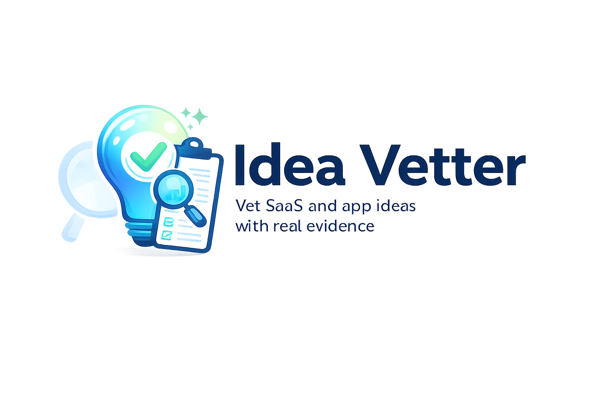

# Idea Vetter

<p align="center">
  
</p>

<p align="center">
  <strong>Vet SaaS and app ideas with real evidence, not vibes.</strong>
</p>

<p align="center">
  <a href="LICENSE"></a>
  <a href="https://github.com/oliverswitzer/idea-vetter"></a>
</p>

Describe a product idea. Idea Vetter researches the market, finds competitors, mines user complaints, scores the opportunity, and produces a structured report with a clear verdict: **proceed, pivot, niche down, or kill**.

## How It Works

This repo is a self-contained Claude Code project. When you open Claude Code in this directory, it automatically loads:

- **Orchestrator** (`.claude/CLAUDE.md`) - The main Idea Vetter persona and workflow
- **Skills** (`.claude/skills/`) - Reusable playbooks owned by specific agents (named `<agent>.<skill>`)
- **Subagents** (`.claude/agents/`) - Specialist agents for focused research tasks
- **MCP servers** (`.mcp.json`) - External tools for web search, trends, app stores, and document export

No configuration lives in your home directory. Everything is project-scoped and version controlled.

## Quick Start

```bash
# 1. Clone and enter
git clone <repo-url> idea-vetter
cd idea-vetter

# 2. Launch Claude Code
claude
```

Then run the setup agent to check dependencies and configure everything automatically:

```
Run the setup-assistant agent to check my environment and set everything up.
```

The agent will check for Node, Python/uvx, Pandoc, and Playwright — install what's missing and initialize git. See [docs/setup.md](docs/setup.md) for manual steps if you prefer.

Once setup is done, describe your idea:

```
Vet this idea: a tool that helps freelance designers manage client revision
requests in one place, replacing email threads and Slack messages.
```

## Repo Structure

```
idea-vetter/
├── .claude/
│   ├── CLAUDE.md                  # Main orchestrator instructions
│   ├── settings.json              # Project-scoped permissions
│   ├── agents/
│   │   ├── idea-vetter.md         # Deep idea evaluation
│   │   ├── trend-researcher.md    # Trend and demand signals
│   │   ├── app-store-analyst.md   # App store competitive analysis
│   │   ├── influencer-scout.md    # YouTube influencer discovery
│   │   └── report-writer.md       # Final report composition
│   └── skills/
│       ├── idea-vetter.idea-scoper/
│       │   └── SKILL.md           # Break ideas into structured components (owned by idea-vetter)
│       ├── idea-vetter.market-evidence-synthesizer/
│       │   └── SKILL.md           # Score and cluster raw evidence (owned by idea-vetter)
│       └── report-writer.report-composer/
│           └── SKILL.md           # Assemble the final report (owned by report-writer)
├── .mcp.json                      # Project-scoped MCP server config
├── docs/
│   ├── setup.md                   # Installation guide
│   ├── usage.md                   # How to use the system
│   └── mcp_servers.md             # MCP server reference and swap guide
├── examples/
│   ├── vet-saas-idea.md           # Example: vet a SaaS idea
│   ├── analyze-app-category.md    # Example: analyze an app market
│   └── generate-report.md         # Example: produce a report
├── reports/                       # Generated vetting reports (markdown)
├── .env.example                   # Environment variable template
├── .gitignore
└── README.md
```

## Workflow Phases

| Phase | What Happens | Key Tools |
|---|---|---|
| 1. Frame | Decompose the idea into user, problem, assumptions | `idea-vetter` agent → `idea-vetter.idea-scoper` skill |
| 2. Research | Gather evidence from web, trends, app stores, forums; find influencers for go-to-market | `trend-researcher`, `app-store-analyst`, `influencer-scout`, WebSearch, Playwright |
| 3. Synthesize | Cluster pain points, score evidence, map gaps | `idea-vetter` agent → `idea-vetter.market-evidence-synthesizer` skill |
| 4. Challenge | Argue against the idea, flag weak evidence | `idea-vetter` agent |
| 5. Recommend | Propose wedge, MVP, verdict | `report-writer` agent → `report-writer.report-composer` skill |

## MCP Servers

| Server | Purpose | Requires |
|---|---|---|
| @playwright/mcp | Browser automation | Chromium |
| google-trends-mcp | Google Trends data | Nothing |
| mcp-pandoc | Report export (PDF/DOCX) | Pandoc binary |

See [docs/mcp_servers.md](docs/mcp_servers.md) for detailed setup and alternatives.

## Scoring Rubric

Every idea gets scored on 9 dimensions (1-10):

| Dimension | What It Measures |
|---|---|
| Problem severity | How painful is the problem? |
| Frequency | How often does it occur? |
| Urgency | How time-sensitive? |
| Willingness to pay | Evidence people will pay |
| Competition pressure | How crowded? (10 = open field) |
| Accessibility | How easy to reach customers? |
| Defensibility | Moats, switching costs, network effects |
| Speed to MVP | How fast can you test this? |
| Overall opportunity | Composite judgment |

## Limitations

- **Evidence quality depends on tools**: If web search or app store pages are rate-limited, evidence will be thinner. The system flags this when it happens.
- **No proprietary data**: This system uses public sources only. It cannot access paid databases like Sensor Tower, data.ai, or SimilarWeb.
- **LLM judgment**: Scoring is Claude's judgment based on evidence, not a formula. Use it as input to your own thinking, not as gospel.
- **Recency**: Web search and trend data are only as current as the sources. Always check dates.
- **Not financial advice**: This is a research and analysis tool, not a substitute for talking to actual customers.

## Extending the System

- **Add a new MCP server**: Edit `.mcp.json`, update agent frontmatter, document in `docs/mcp_servers.md`
- **Add a new skill**: Create `.claude/skills/<agent>.<skill>/SKILL.md` and declare it in the owning agent's `skills:` frontmatter
- **Add a new subagent**: Create `.claude/agents/<name>.md` with frontmatter and instructions
- **Customize the scoring rubric**: Edit `.claude/CLAUDE.md`
- **Change the report format**: Edit `.claude/skills/report-writer.report-composer/SKILL.md`

## Documentation

- [Setup Guide](docs/setup.md) - Installation and configuration
- [Usage Guide](docs/usage.md) - How to use the system
- [MCP Server Reference](docs/mcp_servers.md) - Server details, alternatives, and troubleshooting
